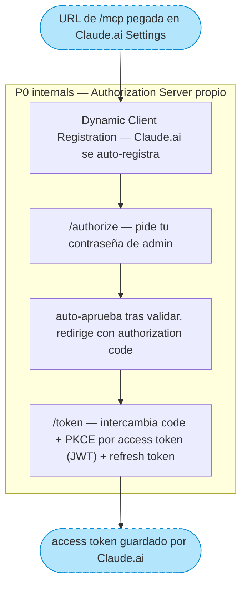
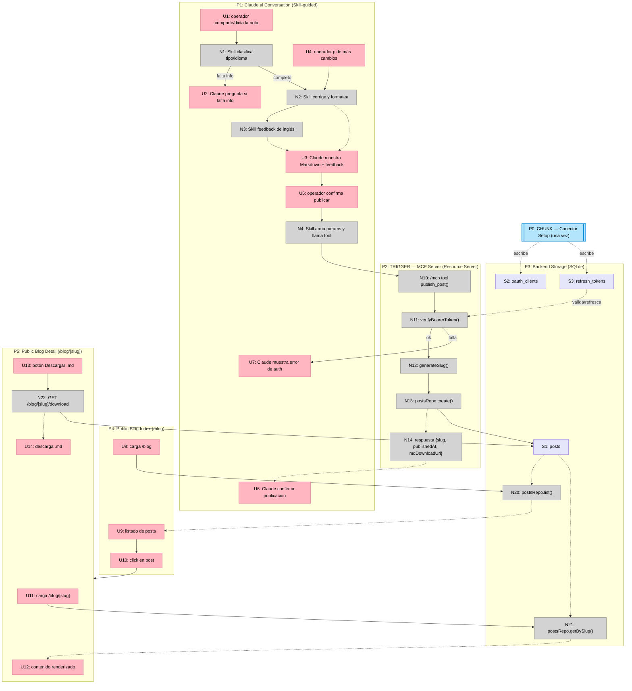

# Sistema de Blog con Ingesta de Notas y Revisión LLM — Shaping

Ver [Frame](./blog-system-frame.md) para Source / Problem / Outcome.

## Requirements (R)

| ID | Requirement | Status |
|----|-------------|--------|
| R0 | Subir contenido (transcripción de audio o texto propio) y obtener una entrada de blog publicada, con fecha y bien formateada | Core goal |
| R1 | El sistema acepta contenido de entrada en inglés y en español | Must-have |
| R2 | **Revisión y corrección vía LLM** | — |
| R2.1 | El texto subido es corregido/formateado por un LLM antes de publicarse | Must-have |
| R2.2 | Para contenido en inglés, la revisión incluye feedback explicativo de las correcciones (qué cambió y por qué), no solo el texto corregido | Must-have |
| R2.3 | Proveedor del LLM a usar | 🟡 Decided: Claude (Anthropic) API |
| R3 | **Tipos de entrada soportados** | — |
| R3.1 | 🟡 Contenido originado en una conversación con Claude.ai (dictada o escrita directamente en el chat) | Must-have |
| R3.2 | Guía técnica con referencias a links externos | Must-have |
| R3.3 | Nota de conocimiento propio, sin audio de origen | Must-have |
| R4 | Formato en que llega el contenido a nuestro sistema | 🟡 Decided: el origen (dictado/escrito) ocurre dentro de la conversación de Claude.ai, fuera de nuestro sistema; a nuestro backend solo llega Markdown ya finalizado vía la tool `publish_post` |
| R5 | La entrada final está disponible como archivo `.md` descargable | Must-have |
| R6 | Flujo de publicación tras la revisión LLM | 🟡 Decided: revisión manual (el usuario ve texto + feedback, edita y confirma antes de publicar) |
| R7 | Solo el autor (dueño del sitio) puede subir/crear entradas | Must-have (a confirmar) |
| R8 | Dónde y en qué formato viven las entradas ya publicadas | 🟡 Decided: storage externo (no archivos .md commiteados a git) |
| R8.1 | Tecnología concreta de storage | 🟡 Decided: SQLite embebida en el servidor (archivo en disco) |

**Notas:**
- Todas las decisiones abiertas quedaron resueltas. Falta confirmar el mecanismo concreto de R7 (autenticación de un solo autor) — el proyecto no tiene hoy ningún sistema de login.
- R8.1 asume que el hosting actual tiene disco persistente entre deploys (coherente con el custom `server.js` + Express, que no es un patrón serverless). Si en algún momento se migra a hosting serverless, esta decisión habría que revisitarla.

---

## A: Ingesta vía Claude.ai (conector MCP + Skill) → confirmación en el chat → SQLite

**Shape final = A3-C + A3 (publicar) + A4 (storage) + A5 (páginas públicas) + A6 (descarga)** — ver exploración de alternativas de canal de interacción más abajo. Sin interfaz gráfica de administración propia y sin panel `curl`: el operador interactúa por chat con Claude.ai (app de escritorio o teléfono), que llama tools sobre un conector MCP propio.

| Part | Mechanism | Flag |
|------|-----------|:----:|
| **A1** | **Servidor MCP remoto (Resource Server + mini Authorization Server)** | |
| A1.1 | `/mcp` (Streamable HTTP) expone las tools `publish_post()`, `list_posts()`, `get_post()` | |
| A1.2 | Resource Server: `requireBearerAuth()` + `verifyAccessToken()` (SDK oficial de MCP) valida el JWT en cada llamada a `/mcp` | |
| A1.3 | Authorization Server propio: Dynamic Client Registration (Claude.ai se auto-registra) + `/authorize` (auto-aprueba tras validar tu contraseña) + `/token` (emite el JWT) — ver [spike](./spike-mcp-connector-auth.md) | |
| **A2** | **Skill de Claude.ai** | |
| A2.1 | Guía la conversación: pregunta el tipo de entrada, corrige/formatea el texto, da feedback de inglés explicado, pide confirmación | |
| A2.2 | Al confirmar, llama la tool `publish_post` (A1.1) | |
| **A3** | **Acción de publicar** | |
| A3.1 | `generateSlug(title, date)` | |
| A3.2 | Guarda la entrada final en A4 (SQLite) con slug, locale, type, fecha, `content_md` | |
| **A4** | **Almacenamiento** | |
| A4.1 | SQLite embebida (archivo en disco del contenedor), tabla `posts` (id, slug, locale, type, title, content_md, created_at) | |
| A4.2 | Agregar `volume` en `docker-compose.yml` para persistir el archivo entre rebuilds — hoy no hay ninguno definido | |
| **A5** | **Páginas públicas del blog** | |
| A5.1 | `/blog` — listado de entradas leyendo desde A4, bilingüe, sigue el patrón `Layout` existente | |
| A5.2 | `/blog/[slug]` — detalle de una entrada, renderiza el Markdown (react-markdown, ya instalado) | |
| **A6** | **Descarga `.md`** | |
| A6.1 | Endpoint que sirve `content_md` de una entrada como archivo descargable | |

No hay un servicio propio de "llamar a la API de Claude para revisar" — la corrección/feedback ocurre nativamente en la conversación de Claude.ai, guiada por la Skill (A2).

## Fit Check: R × A (final)

| Req | Requirement | Status | A |
|-----|-------------|--------|---|
| R0 | Subir contenido y obtener una entrada de blog publicada, con fecha y bien formateada | Core goal | ✅ |
| R1 | Acepta contenido en inglés y español | Must-have | ✅ |
| R2.1 | Corrección/formateo vía LLM | Must-have | ✅ nativo en la conversación de Claude.ai (A2) |
| R2.2 | Feedback explicativo de correcciones en inglés | Must-have | ✅ iterativo, en el chat mismo |
| R2.3 | Proveedor: Claude (Anthropic) | Decided | ✅ |
| R3.1 | Transcripción de nota de voz / conversación | Must-have | ✅ |
| R3.2 | Guía técnica con referencias a links externos | Must-have | ✅ |
| R3.3 | Nota de conocimiento propio, sin audio | Must-have | ✅ |
| R4 | Solo texto (sin subida/transcripción de audio) | Decided | ✅ |
| R4.1 | Cómodo desde el teléfono, sin terminal | Must-have | ✅ app de Claude.ai en el teléfono |
| R5 | Entrada descargable como `.md` | Must-have | ✅ |
| R6 | Revisión manual antes de publicar | Decided | ✅ confirmás en el chat antes de que la Skill llame `publish_post` |
| R7 | Solo el autor puede subir/crear entradas | Must-have | ✅ conector vinculado a tu cuenta personal + mini Authorization Server (A1.3) |
| R8 | Storage externo (no git) | Decided | ✅ |
| R8.1 | SQLite embebida en el servidor | Decided | ✅ |

**Notas:**
- Sin flags pendientes. Shape final seleccionado.
- ⚠️ El **Detail A (breadboard) más abajo todavía describe el diseño anterior** (curl + JWT + `/admin/review` + `/admin/post`), que quedó obsoleto al elegir A3-C. Hay que rehacerlo antes de cortar en slices.

---

## Detail A: Afordancias concretas (Breadboard) — diseño final

El origen del contenido ya no es `curl` — es una conversación real con Claude.ai (Skill-guiada), que puede correr en el teléfono. Las "afordancias UI" del lado Claude.ai son los mensajes del chat (lo que el operador ve y escribe/dicta), aunque vivan fuera de nuestro código. El setup del conector (OAuth) es un flujo aparte, de una sola vez, que se muestra como chunk colapsado.

### Places

| # | Place | Description |
|---|-------|-------------|
| P0 | CHUNK: Conector Setup (una vez) | Vincular Claude.ai con nuestro `/mcp` (DCR + OAuth) |
| P1 | Claude.ai Conversation (Skill-guided) | Donde el operador redacta, itera y confirma |
| P2 | TRIGGER: MCP Server (Resource Server) | Recibe la tool call `publish_post` |
| P3 | Backend Storage (SQLite) | Persistencia de `posts` + credenciales del conector |
| P4 | Public Blog Index (`/blog`) | Listado público de entradas |
| P5 | Public Blog Detail (`/blog/[slug]`) | Vista de una entrada |

### UI Affordances

| # | Place | Affordance | Control | Wires Out | Returns To |
|---|-------|------------|---------|-----------|------------|
| U1 | P1 | mensaje del operador — comparte/dicta el contenido de la nota | type | → N1 | — |
| U2 | P1 | mensaje de Claude preguntando tipo de entrada / idioma faltante | render | — | ← N1 |
| U3 | P1 | mensaje de Claude con el Markdown corregido + feedback de inglés (si aplica) | render | — | ← N2, ← N3 |
| U4 | P1 | operador pide más cambios (iterar) | type | → N2 | — |
| U5 | P1 | operador confirma "publicar" | type | → N4 | — |
| U6 | P1 | mensaje de Claude confirmando publicación (con link) | render | — | ← N14 |
| U7 | P1 | mensaje de Claude con error si el token del conector es inválido | render | — | ← N11 |
| U8 | P4 | carga de página `/blog` | render | → N20 | — |
| U9 | P4 | listado de posts (título, fecha, tipo, extracto) | render | — | ← N20 |
| U10 | P4 | click en tarjeta de post | click | → P5 | — |
| U11 | P5 | carga de página `/blog/[slug]` | render | → N21 | — |
| U12 | P5 | contenido renderizado (react-markdown) | render | — | ← N21 |
| U13 | P5 | botón "Descargar .md" | click | → N22 | — |
| U14 | P5 | descarga de archivo `.md` en el navegador | render | — | ← N22 |

### Code Affordances

| # | Place | Affordance | Control | Wires Out | Returns To |
|---|-------|------------|---------|-----------|------------|
| N1 | P1 | Skill — clasifica tipo de entrada / idioma (pregunta si falta) | call | → U2 / → N2 | — |
| N2 | P1 | Skill — corrige y formatea el texto a Markdown | call | → N3 | → U3 |
| N3 | P1 | Skill — si locale=en, genera feedback explicado de correcciones | call | — | → U3 |
| N4 | P1 | Skill — arma parámetros finales `{content_md, locale, type, date?}` y llama la tool | call | → N10 | — |
| N10 | P2 | `/mcp` tool `publish_post()` | call | → N11 | — |
| N11 | P2 | `verifyBearerToken()` — valida el access token emitido en P0 | call | → N12 (ok) / → U7 (falla) | — |
| N12 | P2 | `generateSlug(title, date)` | call | → N13 | — |
| N13 | P2 | `postsRepo.create()` | write | → S1 | → N14 |
| N14 | P2 | respuesta de la tool `{slug, publishedAt, mdDownloadUrl}` | return | — | → U6 |
| N20 | P3 | `postsRepo.list(locale?)` | call | reads S1 | → U9 |
| N21 | P3 | `postsRepo.getBySlug(slug)` | call | reads S1 | → U12 |
| N22 | P5 | `GET /blog/[slug]/download` handler | call | reads S1 | → U14 |

### Data Stores

| # | Place | Store | Description |
|---|-------|-------|--------------|
| S1 | P3 | `posts` | id, slug, locale, type, title, content_md, created_at — SQLite en disco (requiere `volume` en `docker-compose.yml`, A4.2) |
| S2 | P3 | `oauth_clients` | Registrado por DCR (P0) — client_id, redirect_uris |
| S3 | P3 | `refresh_tokens` | Emitido por `/token` (P0) — permite refrescar/revocar el access token sin repetir `/authorize` |

### P0 (chunk): Conector Setup — detalle

`A` escribe en **S2** (`oauth_clients`); `D` escribe en **S3** (`refresh_tokens`) y entrega el access token que **N11** valida en cada llamada a `publish_post`.

### Wiring principal (Mermaid)

**Notas:**
- `corrections` (feedback de inglés) se genera y se muestra en `U3`, pero no se persiste en `S1` — sigue pendiente confirmar si conviene guardarlo para un historial de aprendizaje.
- Sigue pendiente decidir si `/blog` (`U9`) filtra por el locale activo del sitio o muestra todo sin filtrar.
- A4.2 (`volume` en `docker-compose.yml`) es config de despliegue — se anota junto a `S1`/`S2`/`S3` porque es lo que los hace persistentes entre rebuilds.
- El loop de iteración (`U4` → `N2`) es deliberadamente simple: cada vuelta reemplaza el Markdown mostrado en `U3`, no acumulamos historial de versiones.

---

## R9 (nuevo, extiende R4): Comodidad de interacción desde el teléfono

| ID | Requirement | Status |
|----|-------------|--------|
| R4.1 | La interacción para subir/revisar debe ser cómoda desde el teléfono, inmediatamente después de grabar la nota (no requiere terminal/SSH) | 🟡 Nuevo — Must-have |

## A3: Canal de interacción del operador — explorando alternativas

Esto reemplaza/redefine A1 (auth) + A2 (servicio de revisión) + A3 (endpoints) juntos, según la alternativa elegida.

### A3-A: curl directo (diseño original)

| Part | Mechanism |
|------|-----------|
| A3-A.1 | JWT de corta duración vía `/admin/login` (A1 original) |
| A3-A.2 | Claude API llamada server-side (A2 original) |
| A3-A.3 | `/admin/review` (una pasada, JSON) + `/admin/post` |
| A3-A.4 | Para iterar, el usuario vuelve a llamar `/admin/review` a mano con el texto editado |

### A3-B: Bot de Telegram

| Part | Mechanism |
|------|-----------|
| A3-B.1 | Bot registrado vía BotFather, token en env var |
| A3-B.2 | `POST /admin/telegram/webhook` — recibe mensajes; solo responde al `chat_id` del autor (whitelist) |
| A3-B.3 | Al recibir texto, llama a Claude API server-side (A2 original) y responde en el chat con Markdown + feedback |
| A3-B.4 | El usuario puede seguir chateando para iterar (el bot mantiene el historial de la conversación y vuelve a llamar a Claude) |
| A3-B.5 | Comando/botón inline "Publicar" → dispara A4 (guardar en SQLite) |

### A3-C: Conector MCP remoto para Claude.ai

| Part | Mechanism | Flag |
|------|-----------|:----:|
| A3-C.1 | Servidor MCP remoto (Streamable HTTP) expone tools: `publish_post()`, `list_posts()`, `get_post()` | |
| A3-C.2 | Autenticación del conector: mini Authorization Server propio (DCR + `/authorize` con auto-aprobación por contraseña + `/token` que emite JWT) + Resource Server en `/mcp` (resuelto casi entero por el SDK oficial de MCP vía `requireBearerAuth`). Ver [spike](./spike-mcp-connector-auth.md) | |
| A3-C.3 | La revisión/corrección/feedback ocurre en la conversación nativa con Claude.ai — no hace falta llamar a la API de Claude por separado (A2 deja de existir como servicio) | |
| A3-C.4 | Cuando el usuario pide publicar, Claude llama la tool `publish_post` → dispara A4 | |
| A3-C.5 | Skill de Claude.ai (subida a tu cuenta, no vive en este repo salvo copia versionada en `docs/`) que guía la conversación: pregunta el tipo de entrada, corrige/formatea, da feedback de inglés explicado, pide confirmación y recién ahí llama `publish_post` | |

### Fit Check: R × A3 alternativas (final)

| Req | Requirement | Status | A3-A | A3-B | A3-C |
|-----|-------------|--------|------|------|------|
| R2.2 | Feedback explicado en inglés, iterativo | Must-have | ✅ (no iterativo, una pasada) | ✅ | ✅ |
| R4.1 | Cómodo desde el teléfono, sin terminal | Must-have | ❌ | ✅ | ✅ |
| R6 | Revisión manual antes de publicar | Decided | ✅ | ✅ | ✅ |
| R7 | Solo el autor puede publicar | Must-have | ✅ (JWT) | ✅ (whitelist chat_id) | ✅ (cuenta personal + auth conector) |

**Notas:**
- A3-A falla R4.1: correr `curl` desde el teléfono es incómodo (aunque sea técnicamente posible con apps tipo Termux).
- A3-C y A3-B quedan empatadas en el fit check formal — la diferencia está fuera de la tabla: A3-C reusa Claude.ai mismo como interfaz conversacional (nada de loop de chat propio que mantener) y suma la Skill (A2) como capa de guion versionable, a cambio de construir un mini Authorization Server (ya des-flagged por el [spike](./spike-mcp-connector-auth.md)). A3-B evita el Authorization Server pero exige mantener nuestro propio loop de conversación en el bot.
- A3-A queda descartada (falla R4.1) y A3-B descartada (se prefiere la interfaz nativa de Claude.ai). Se conservan acá como registro de las alternativas evaluadas.

**Selección: A3-C.** Sin flags pendientes — ver Shape A final arriba.
