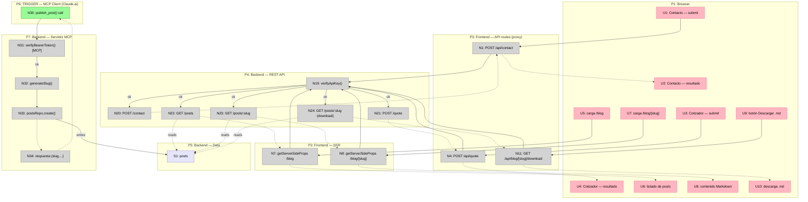

# Separar Frontend y Backend en dos subproyectos — Shaping

Ver [Frame](./frontend-backend-split-frame.md) para Source / Problem / Outcome.

## CURRENT: Cómo funciona hoy

| # | Mechanism |
|---|-----------|
| CURRENT1 | Un solo proceso Node: `server.js` (Express, CommonJS) envuelve el request handler de Next.js |
| CURRENT2 | `server.js` resuelve locale detection y CSRF antes de delegarle todo lo demás a Next (`handle(req, res)`) |
| CURRENT3 | La lógica de servidor "real" (SQLite: `src/server/db.ts`, `src/server/postsRepo.ts`) vive en TypeScript, importada *en el mismo proceso* por API routes (`src/pages/api/`) y por `getServerSideProps` de páginas (ej. `/blog`) |
| CURRENT4 | Un solo Dockerfile, una sola imagen, un solo servicio en `docker-compose.yml`, un solo deploy |
| CURRENT5 | `server.js` y `src/server/detectLocale.js` son los únicos módulos en JS plano (CommonJS) — todo lo demás bajo `src/` es TypeScript compilado por Next |

---

## Requirements (R)

| ID | Requirement | Status |
|----|-------------|--------|
| R0 | Frontera clara entre lógica de frontend y lógica de backend (acceso a datos, reglas de negocio, APIs para clientes que no son las propias páginas del sitio) | Core goal |
| R1 | El servidor MCP (`/mcp`, ATA-3 en adelante) lo expone el backend directamente, alcanzable por un cliente externo (Claude.ai) sin pasar por maquinaria específica de Next.js | Must-have |
| R2 | Las páginas que hoy leen datos server-side (ej. `/blog` vía `getServerSideProps` → `postsRepo.list()`) siguen funcionando, aunque cambie el mecanismo de acceso a datos | Must-have |
| R3 | El backend queda escrito en TypeScript con un Express "de verdad" (tipado, estructurado) — reemplaza al `server.js` CommonJS actual | Must-have |
| R4 | El flujo de desarrollo local se mantiene simple — un comando (o un par corto y documentado) levanta frontend y backend juntos | Must-have |
| R5 | La complejidad de deploy se mantiene proporcional a un sitio de portfolio personal de un solo desarrollador — evitar pagar costo de escala de equipo/microservicios que hoy no hace falta | Must-have |
| R6 | Esta iniciativa no bloquea indefinidamente el resto de los slices del sistema de blog (ATA-3 en adelante) — debe poder entregarse en un primer corte acotado | Must-have |
| R7 | El split deja abierta la puerta a que futuros clientes no-frontend (ej. una app mobile) consuman el backend sin cambios de arquitectura adicionales | Nice-to-have — 🟡 a confirmar si de verdad lo queremos ahora o es especulativo |

**Notas:**
- R7 es la más especulativa — el proyecto en general evita diseñar para requisitos hipotéticos futuros. La dejo anotada porque el usuario mencionó querer "un backend real", pero vale la pena confirmar si es un driver real o si alcanza con R1 (MCP) como único cliente no-frontend concreto hoy.
- Todavía no hay una decisión sobre si *todo* lo que hoy es server-side (incluyendo `/api/contact`, `/api/quote`, que solo sirven al propio frontend) se muda al backend, o si el split es más angosto: solo lo que necesita ser alcanzable por clientes no-frontend (MCP) + la capa de datos que ambos comparten. Esto se resuelve al detallar los componentes de la shape.

---

## A: Frontend Next.js + backend Express/TS separados (pnpm workspace)

Propuesta inicial del usuario, formalizada como shape para poder chequearla contra R.

| Part | Mechanism | Flag |
|------|-----------|:----:|
| **A1** | **Workspace** | |
| A1.1 | `pnpm-workspace.yaml` en la raíz, dos apps: `apps/frontend` (Next.js, contenido actual de `src/`) y `apps/backend` (Express + TS nuevo) | |
| **A2** | **Backend owns data + MCP** | |
| A2.1 | `apps/backend` absorbe `src/server/` actual (`db.ts`, `postsRepo.ts`) más lo pendiente de ATA-3 (`generateSlug`, `mcpAuth`, servidor MCP) — 🟡 y además `/api/contact` y `/api/quote` (toda la lógica server-side se muda, no solo la de MCP) | |
| A2.2 | 🟡 Backend expone `/mcp` directo, en su propio puerto/proceso — Claude.ai le pega ahí sin pasar por Next (resuelto por construcción: es su propia app Express) | |
| A2.3 | 🟡 Backend expone una API HTTP **REST** propia (posts, contact, quote) — forma decidida | |
| **A3** | **Frontend consume backend por HTTP, con obfuscación** | |
| A3.0 | 🟡 El frontend mantiene sus propias API routes (`/api/contact`, `/api/quote`, `/api/blog/*`) como proxies delgados — el browser solo les habla a **estas**; ellas reenvían al REST del backend. El backend real nunca es llamado directo desde el browser (obfuscación). Única excepción: `/mcp`, que el backend expone directo para Claude.ai (R1) — sin proxy del frontend de por medio | |
| A3.1 | 🟡 `/blog` (`getServerSideProps`) corre server-side (sin browser de por medio) — llama **directo** al REST del backend con el API key (A6), no hace falta pasar por su propio proxy ya que no hay browser al medio | |
| A3.2 | 🟡 `/blog/[slug]` y la descarga `.md` — mismo mecanismo que A3.1 | |
| **A6** | **Auth interno frontend↔backend** | |
| A6.1 | 🟡 Backend valida un **API key estático** (bearer token, comparación timing-safe) en cada llamada REST del frontend, antes de procesarla — mismo patrón que `MCP_BEARER_TOKEN` de ATA-3, secreto propio (`BACKEND_API_KEY` o similar) | |
| A6.2 | El token MCP (Claude.ai → backend, de ATA-3) sigue siendo un mecanismo separado del API key interno — distintos consumidores, distintos secretos | |
| **A4** | **Deploy** | |
| A4.1 | 🟡 `docker-compose.yml` con dos servicios (`frontend`, `backend`) en la misma red interna — topología resuelta, quedan detalles menores (healthchecks, orden de arranque) | |
| A4.2 | Backend es dueño del volumen SQLite (`blog-data`) — frontend ya no toca el filesystem de datos | |
| **A5** | **Dev local** | |
| A5.1 | Un comando levanta ambos (`concurrently`, scripts de pnpm workspace, o similar) | ⚠️ |

---

## B: Monolito modular — mismo proceso, fronteras de código estrictas

Alternativa más liviana, para comparar contra A antes de decidir.

| Part | Mechanism |
|------|-----------|
| B1 | `server.js` → `server.ts`, compilado en el build, mismo proceso Express envolviendo Next (como hoy) |
| B2 | `src/server/` pasa a ser un módulo con frontera estricta: nada ahí importa de `src/pages`/`src/components`/`src/context` (solo la dirección inversa) |
| B3 | `/mcp` sigue siendo una ruta de Next (`src/pages/api/mcp.ts` + rewrite, como se había planeado para ATA-3) — no hay proceso backend separado que lo sirva "directo" |
| B4 | Un solo Dockerfile, un solo servicio en `docker-compose.yml` (como hoy) |
| B5 | Dev local: un solo `npm run dev` (como hoy, sin cambios) |

---

## Fit Check: R × A × B

| Req | Requirement | Status | A | B |
|-----|-------------|--------|---|---|
| R0 | Frontera clara entre frontend y backend | Core goal | ✅ | ✅ (a nivel de código — import rules — no de proceso/deploy) |
| R1 | `/mcp` servido directo por el backend, sin pasar por Next | Must-have | ✅ | ❌ |
| R2 | Páginas server-side actuales siguen funcionando | Must-have | ✅ (vía fetch al REST) | ✅ (sin cambios) |
| R3 | Backend en TypeScript, Express real | Must-have | ✅ | ✅ |
| R4 | Dev local simple | Must-have | ⚠️ (flagged — A5.1, falta decidir el mecanismo) | ✅ |
| R5 | Complejidad de deploy proporcional al proyecto | Must-have | ✅ (dos servicios en un mismo `docker-compose.yml`, sin infra adicional real) | ✅ |
| R6 | No bloquea indefinidamente el resto del blog | Must-have | ⚠️ (depende de cómo se corte en slices — todavía sin definir el primer corte demoable) | ✅ (lift mucho menor, desbloquea ATA-3 casi de inmediato) |
| R7 | Abre la puerta a futuros clientes no-frontend | Nice-to-have | ✅ | ❌ |

**Notas:**
- B falla R1 de forma estructural: sin un proceso/deploy separado, no existe "el backend" como algo que Claude.ai pueda llamar sin pasar por Next — solo hay código mejor organizado dentro del mismo proceso.
- A todavía tiene dos ⚠️ genuinos antes de poder seleccionarse sin flags: **A5.1** (mecanismo de dev local todavía sin decidir) y **R6** (sin slicing, no sabemos cuán grande es el primer corte demoable).
- Si R1 y R7 importan de verdad (parecen ser el motivo original de esta conversación), A es la única de las dos que los satisface — B es una alternativa honesta pero estructuralmente más limitada, útil sobre todo como referencia de cuánto "más caro" es A.

---

## Decisión

**Shape seleccionada: A** (frontend Next.js + backend Express/TS separados, pnpm workspace, REST + API key estático). B queda descartada por fallar R1 y R7 de forma estructural — el usuario confirmó que esos dos son drivers reales, no especulativos.

Quedan dos cosas antes de poder detallar A sin flags:
- **A5.1**: decidir el mecanismo de dev local (candidato simple: script npm en la raíz con `concurrently` o los scripts nativos de pnpm workspace — filtrar antes de un spike si hace falta).
- **R6**: cortar A en slices verticales demoables, para tener un primer incremento chico que no bloquee indefinidamente el resto del sistema de blog.

Próximo paso: breadboardear A (usar `/breadboarding`) para llegar a afordancias concretas, y de ahí cortar en slices.

---

## Detail A: Afordancias concretas (Breadboard)

**Simplificación deliberada:** las páginas del browser (contacto, cotizador, `/blog`, `/blog/[slug]`) se agrupan bajo un único Place `P1: Browser` — lo que cambia acá no es la UI (sigue siendo exactamente la misma), sino el cableado server-side por debajo. Separar cada página en su propio Place no agregaría información nueva para este breadboard puntual.

### Places

| # | Place | Description |
|---|-------|-------------|
| P1 | Browser | Formularios de contacto/cotización, páginas `/blog` y `/blog/[slug]`, botón de descarga — tal como se ven hoy |
| P2 | Frontend — SSR (`getServerSideProps`) | Corre en el proceso del frontend, sin browser de por medio |
| P3 | Frontend — API routes | Proxies delgados que el browser sí llama directo (`/api/contact`, `/api/quote`, `/api/blog/[slug]/download`) |
| P4 | Backend — REST API | Express/TS nuevo, dueño de la lógica de negocio |
| P5 | Backend — Data | SQLite (`posts`), exclusivamente detrás del backend |
| P6 | TRIGGER: MCP Client (Claude.ai) | Cliente externo, no pasa por el frontend |
| P7 | Backend — Servidor MCP (`/mcp`) | Expone `publish_post` (ATA-3) |

### UI Affordances

| # | Place | Affordance | Control | Wires Out | Returns To |
|---|-------|------------|---------|-----------|------------|
| U1 | P1 | Formulario de contacto — submit | click | → N1 | — |
| U2 | P1 | Formulario de contacto — mensaje éxito/error | render | — | ← N1 |
| U3 | P1 | Calculadora de cotización — submit | click | → N4 | — |
| U4 | P1 | Calculadora — resultado de estimación | render | — | ← N4 |
| U5 | P1 | Carga de página `/blog` | render | → N7 | — |
| U6 | P1 | Listado de posts | render | — | ← N7 |
| U7 | P1 | Carga de página `/blog/[slug]` | render | → N9 | — |
| U8 | P1 | Contenido renderizado (Markdown) | render | — | ← N9 |
| U9 | P1 | Botón "Descargar .md" | click | → N11 | — |
| U10 | P1 | Descarga de archivo `.md` en el navegador | render | — | ← N11 |

### Code Affordances

| # | Place | Affordance | Control | Wires Out | Returns To |
|---|-------|------------|---------|-----------|------------|
| N1 | P3 | `POST /api/contact` (proxy) | call | → N19 → N20 | → U2 |
| N4 | P3 | `POST /api/quote` (proxy) | call | → N19 → N21 | → U4 |
| N7 | P2 | `getServerSideProps` de `/blog` | call | → N19 → N22 | → U6 |
| N9 | P2 | `getServerSideProps` de `/blog/[slug]` | call | → N19 → N23 | → U8 |
| N11 | P3 | `GET /api/blog/[slug]/download` (proxy) | call | → N19 → N24 | → U10 |
| N19 | P4 | `verifyApiKey()` — middleware, valida `BACKEND_API_KEY` en toda llamada REST entrante al backend | call | → N20/N21/N22/N23/N24 (ok) / → 401 (falla, vuelve al caller) | — |
| N20 | P4 | `POST /contact` — envía email vía Mailgun (lógica existente, reubicada) | call | — | → N1 |
| N21 | P4 | `POST /quote` — corre `quoteCalculator` (lógica existente, reubicada) | call | — | → N4 |
| N22 | P4 | `GET /posts` — `postsRepo.list()` | call | reads S1 | → N7 |
| N23 | P4 | `GET /posts/:slug` — `postsRepo.getBySlug()` | call | reads S1 | → N9 |
| N24 | P4 | `GET /posts/:slug` (mismo endpoint, reutilizado para servir la descarga) | call | reads S1 | → N11 |
| N30 | P6 | Claude.ai llama tool `publish_post()` | call | → N31 | — |
| N31 | P7 | `verifyBearerToken()` — token MCP de ATA-3, mecanismo separado de N19 (distinto consumidor, distinto secreto) | call | → N32 (ok) / → error (falla) | — |
| N32 | P7 | `generateSlug(title, date)` | call | → N33 | — |
| N33 | P7 | `postsRepo.create()` | write | → S1 | → N34 |
| N34 | P7 | respuesta `{slug, publishedAt, mdDownloadUrl}` | return | — | → N30 |

### Data Stores

| # | Place | Store | Description |
|---|-------|-------|--------------|
| S1 | P5 | `posts` | Tabla SQLite — pasa a vivir exclusivamente en el proceso backend; ni el frontend ni ningún otro consumidor tocan el archivo directo |

### Wiring principal (Mermaid)

**Notas:**
- `N19` (verificación de API key) es un único mecanismo compartido por las cinco llamadas frontend→backend — se define una vez, todas lo referencian, en vez de duplicar la verificación en cada endpoint.
- `N30`/`N31` corren en un mundo completamente aparte de `P1`-`P3` — Claude.ai nunca pasa por el frontend, que es exactamente lo que pedía R1.
- Ver [Slices](./frontend-backend-split-slices.md) para el corte en incrementos verticales.
